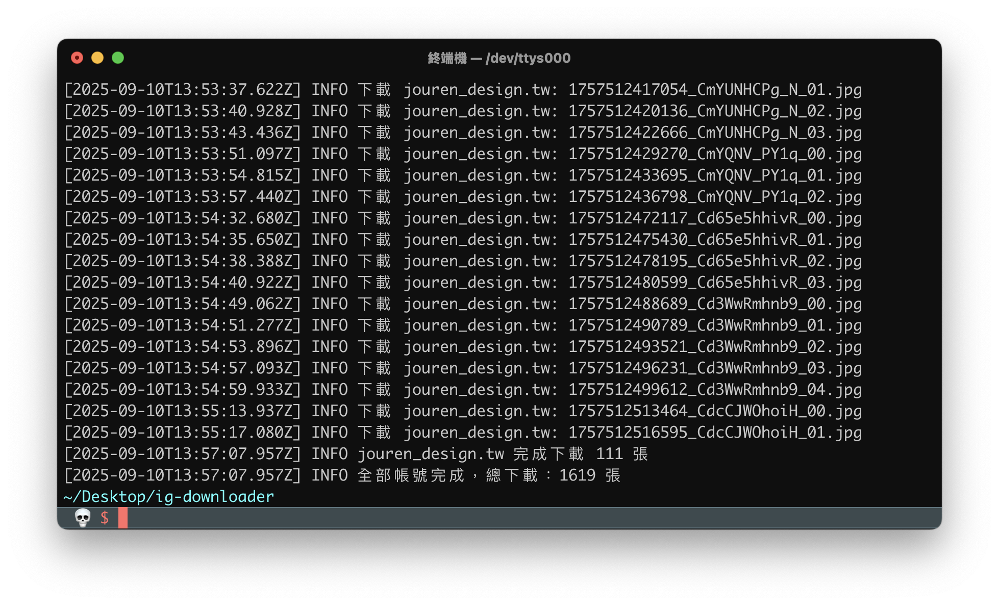

# IG 影像抓取器 (Instagram Image Scraper)

以原生 Node.js 為主，配合 Playwright 無頭瀏覽，從 `ig.txt` 讀取帳號（或完整網址），依帳號分資料夾下載貼文「圖片」。預設僅抓取貼文類型 `/p/` 之「內容圖片」（高解析度），不抓縮圖、不抓頭像、不抓影片。



## 特色
- 僅抓作品圖片：過濾縮圖與非內容資源，選擇高解析度版本。
- 分帳號輸出：`downloads/<username>/`，含 manifest 與快取，支援續抓不重覆。
- 最小依賴：主程式使用 Node 原生模組；瀏覽器以 Playwright 啟動（可用 npx 安裝瀏覽器二進位）。
- 彈窗處理與 carousel 支援：自動處理常見彈窗，逐張抓取多張貼文。

## 需求
- Node.js 18+
- 第一次需安裝瀏覽器二進位（Chromium）：
```
cd ig-downloader
npx playwright install chromium
```

## 快速開始
1) 準備帳號清單（每行一個；可用名稱/＠名稱/完整網址）
- `ig.txt` 範例：
  - `nasa`
  - `@natgeo`
  - `https://www.instagram.com/nasa/`

2) 建立資料夾（可省略）
```
node src/index.js
```

3) 開始抓取（建議單工較穩）
```
node src/index.js --mode headless --concurrency 1 --delay '1500-2800' --max-per-user 0
```

4) 提供 Cookie（可選，但能提高可見度／穩定度；風險自負）
- 將瀏覽器的 `sessionid` 值存到專案根目錄 `IG_SESSIONID.txt`（只需值本身或 `sessionid=...` 均可），程式會自動讀取。
- 或以環境變數注入：
```
IG_SESSIONID=你的cookie node src/index.js --mode headless
```

5) 調試（可觀察瀏覽器畫面）
```
HEADFUL=1 SLOWMO=120 node src/index.js --mode headless --concurrency 1 --delay '1500-2800'
```

## 參數說明
- `--input`：帳號清單檔路徑，預設 `ig.txt`
- `--out`：輸出根目錄，預設 `downloads`
- `--mode`：`headless`（建議；純 HTTP 模式不穩定故暫不提供）
- `--max-per-user`：每帳號最多下載張數；`0` 表示不限
- `--concurrency`：同時處理帳號數；建議 `1`
- `--delay`：每張圖/每篇之間的隨機延遲（毫秒範圍字串），例：`'1500-2800'`（請務必加引號，避免 zsh 誤判）
- 環境變數：
  - `IG_SESSIONID`：Instagram `sessionid`（可改用 `IG_SESSIONID.txt` 自動載入）
  - `HEADFUL=1`：以「有頭模式」開視窗
  - `SLOWMO=<ms>`：放慢動作，便於觀察

## 輸出結構
```
downloads/
  <username>/
    .downloaded.json       # 下載快取（避免重覆）
    manifest.jsonl         # 每行一筆 JSON 紀錄
    *.jpg                  # 下載圖片（檔名：<timestamp>_<shortcode>_<idx>.jpg）
    debug_*.png/.html      # 取不到時的偵錯截圖/頁面（僅在需要時生成）
```

manifest.jsonl 欄位（每行一筆）：
- `username`、`shortcode`、`postUrl`、`imageUrl`、`filename`、`postTime`、`downloadedAt`

## 抓取邏輯（簡述）
1. 進入帳號頁 → 自動滾動收集 `/p/` 連結（僅貼文，不含 reel/tv）。
2. 逐篇貼文：
   - 抓取貼文內 `article` 的最高畫質圖片（忽略縮圖、頭像、非內容資源）。
   - 支援 carousel，逐張點擊並收集。
3. 若 1 無法取得，嘗試直接點開網格第一張進 overlay，於 overlay 逐篇切換抓取。
4. 若仍失敗，輸出 `debug_*.png/html` 協助排查。

## 常見問題
- 終端機顯示 `command not found: 1500-2800`：`--delay` 的值請加引號，如 `--delay '1500-2800'`。
- 全部顯示 0 張：
  - 先用 `HEADFUL=1` 觀察是否被登入牆擋住或版面差異。
  - 提供 `IG_SESSIONID`（`IG_SESSIONID.txt` 或環境變數）。
  - 將 `debug_*.html/png` 附上以利調整選擇器。
- 只想抓少量測試：`--max-per-user 10`。

## 法律與道德
- 僅抓取你有權限保存的公開內容；尊重版權與隱私。
- 遵守 Instagram 服務條款與速率限制，避免高頻請求。
- 若內容需要登入或為私人帳號，請勿嘗試繞過。

## 開發備註
- 本工具以 Node.js 標準庫為主，不落地安裝大量依賴。瀏覽過程依賴 Playwright 啟動 Chromium（需一次性下載瀏覽器二進位）。
- IG 前端更新頻繁，若抓取失效，請回報 `debug_*.html/png` 與錯誤日誌，我們會更新選擇器或流程。
